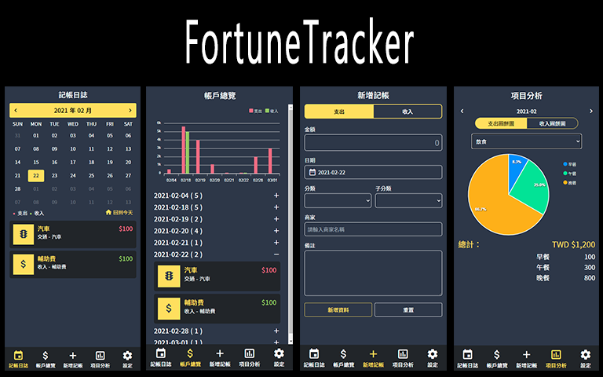

# 我的記賬本

記帳軟體 Side Project，包含記帳紀錄之建置、修改、刪除等功能，以及圖表分析。
頁面設計參考 [Money Tracker](https://github.com/waveciou/MoneyTracker)
[Demo](https://fortunetracker-1bb65.uc.r.appspot.com/admin)

## 使用技術
- 使用 Nuxt.js 製作 SSR 網頁，並 deploy 到 Google App Engine。
- 串接 firebase 儲存記帳資料。
- 使用 moment.js 製作 Calendar & Datepicker。
- 使用 ApexCharts.js 呈現數據圖表項目。